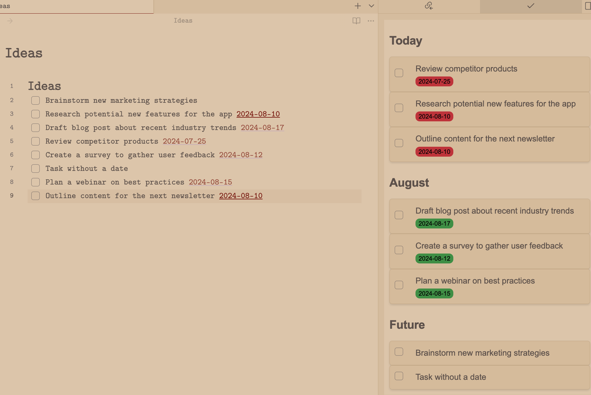

# All Tasks Here (Obsidian Plugin)

[](https://github.com/arkimedz-gh/obsidian-all-tasks-here/actions/workflows/test.yml)

A simple, lightweight plugin to help you manage your tasks in [Obsidian](https://obsidian.md/). It provides a single pane of glass with optional filters.

## Features
- Show tasks in your sidebar
- Group tasks by due date
- Complete tasks from your sidebar
- Quickly jump to the task in the file from your sidebar
- Works with Daily Notes
- Looks beautiful with different themes

## Settings
**Date tag format**: Customizable tag format for due dates.

**Date format**: Customizable date format. Uses Luxon under the hood. See [their documentation](https://moment.github.io/luxon/#/formatting?id=table-of-tokens) for supported tokens.

**Open files in a new leaf**: When enabled, files opened from within the plugin will open in a new leaf rather than replacing the currently opened file.

**Only show current file**: If enabled, only the current file is parsed for TODOs to improve performance for large vaults.

**Only show TODOs with a date**: If enabled, only TODOs with a date will be shown.

## Screenshots
All tasks in the sidebar


Works well with other themes





## Development
```bash
yarn install
yarn build
```

`./sync.sh` will sync the latest version of the plugin to your Obsidian vault.

## Related
There are several other plugins that provide similar functionality. Many are listed here: [Task management plugins](https://publish.obsidian.md/hub/02+-+Community+Expansions/02.01+Plugins+by+Category/Task+management+plugins). The most similar ones are:

- [delashum/obsidian-checklist-plugin](https://github.com/delashum/obsidian-checklist-plugin)
- [larslockefeer/obsidian-plugin-todo](https://github.com/larslockefeer/obsidian-plugin-todo): This is the single most important inspiration for this plugin.